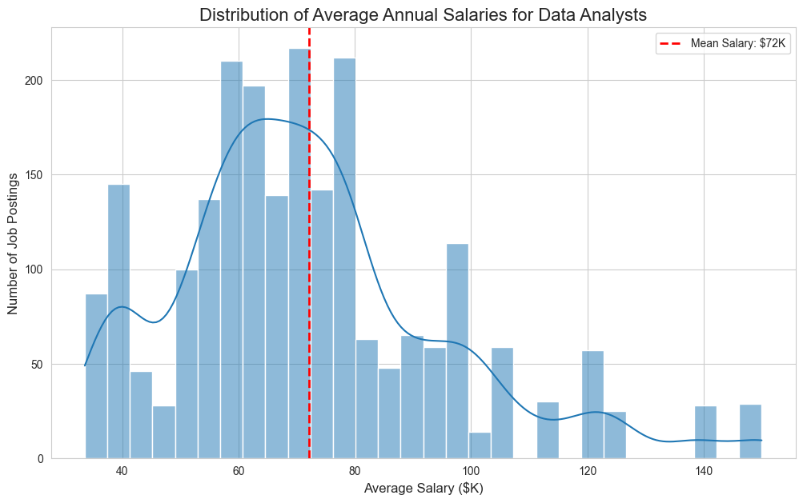
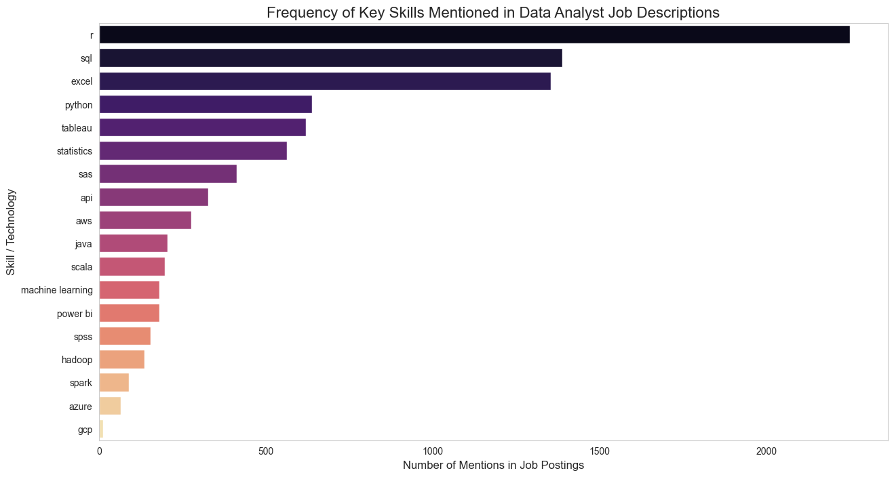
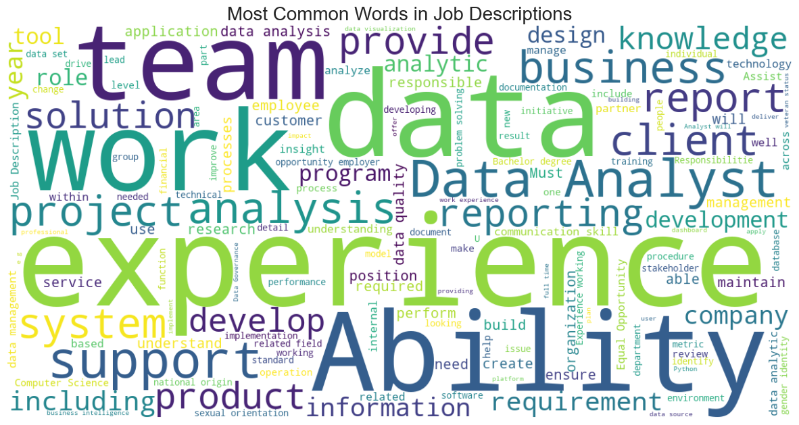

# Data Analyst Jobs Analysis

### An Exploratory Data Analysis of the US Job Market for Data Analysts


## Project Overview

This project is an exploratory data analysis (EDA) of job postings for Data Analyst positions in the United States. The primary goal is to uncover key insights into the job market, focusing on salary trends and the most in-demand technical skills.

The analysis involves advanced data cleaning techniques, particularly for parsing and transforming unstructured text data (salary estimates, company names). The core of the project is a text-mining analysis of job descriptions to identify and rank the most sought-after skills and technologies.

## Key Questions & Objectives

1.  What is the typical salary range for a Data Analyst in the US?
2.  How do factors like company size and ownership type influence salary?
3.  What are the most frequently required technical skills and tools (Python, SQL, Tableau, etc.)?
4.  What are the most common terms found in job descriptions?

## Dataset

The dataset used is the "Data Analyst Jobs" collection from Kaggle, containing over 2,000 job postings.

**Key Data Cleaning & Preparation Steps:**
*   Parsed and transformed complex string-based salary estimates into numerical columns (`min_salary`, `max_salary`, `avg_salary`).
*   Cleaned company names by removing appended ratings.
*   Standardized missing value placeholders (`-1`) into a consistent `NaN` format.

## Technical Stack

*   **Language:** Python 3.13
*   **Libraries:**
    *   Pandas & NumPy for data manipulation.
    *   Matplotlib & Seaborn for data visualization.
    *   WordCloud for text visualization.
*   **Environment Management:** `uv`

## How to Run This Project

To reproduce this analysis, please follow these steps:

1.  **Clone the repository:**
    ```bash
    git clone https://github.com/YOUR_USERNAME/data-analyst-jobs-analysis.git
    cd data-analyst-jobs-analysis
    ```

2.  **Create and activate a virtual environment:**
    ```bash
    uv venv
    source .venv/bin/activate
    ```

3.  **Install the required packages:**
    ```bash
    uv pip install -r requirements.txt
    ```

4.  **Launch JupyterLab and run the notebook.**

## Visualizations Showcase

Here are some of the key insights discovered during the analysis:


*A histogram showing the distribution of average salaries, with a mean of approximately $91K.*


*A bar chart ranking the most in-demand skills, clearly showing the dominance of Python, SQL, and Excel.*


*A word cloud visualizing the most frequent terms in job descriptions, highlighting keywords like "data," "business," and "experience."*

## Possible Next Steps

*   **Geographic Analysis**: Analyze how salary and skill requirements differ by state or city.
*   **Predictive Modeling**: Build a model to predict a job's salary based on its description and attributes.